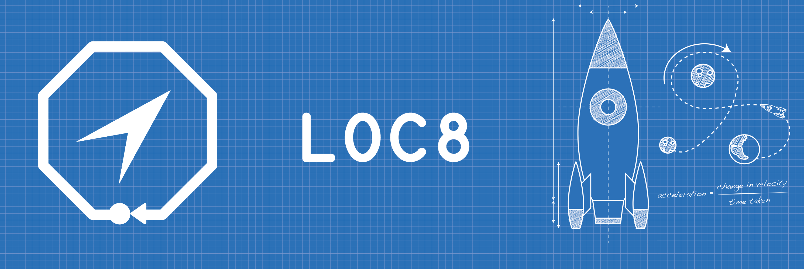

<!-- 


 |
[](https://travis-ci.com/Marwan-Al-Masri/LOC8)
[](https://www.codacy.com?utm_source=github.com&amp;utm_medium=referral&amp;utm_content=Marwan-Al-Masri/LOC8&amp;utm_campaign=Badge_Grade)

[](https://codecov.io/gh/Marwan-Al-Masri/LOC8) -->


[](https://travis-ci.com/Marwan-Al-Masri/LOC8)
[](https://www.codacy.com?utm_source=github.com&amp;utm_medium=referral&amp;utm_content=Marwan-Al-Masri/LOC8&amp;utm_campaign=Badge_Grade)
 [](https://codecov.io/gh/Marwan-Al-Masri/LOC8)
<!--
☂︎ Development | ☂︎ Production
---|---
 |  -->

# LOC8

 LOC8 is a mobile application project that detect a human motion in three dimensions.

## Requirements
- Swift 4.0
- Xcode 9.0 and above
- Mac OS 10.13 and above

## Get Started
before you start you should read the [project fundamentals](Documentation/Fundamentals.md)

```bash
open LOC8.xcodeproje
```
## Contributing
If you are new to this repository, please read [development doc](Documentation/Development.md) first.

## License
LOC8 Sdn Bhd
